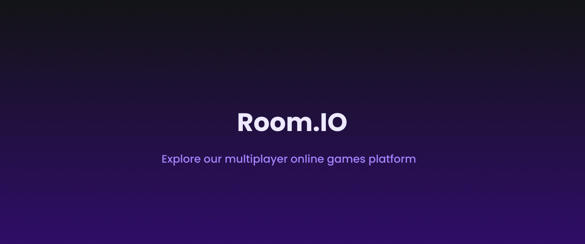
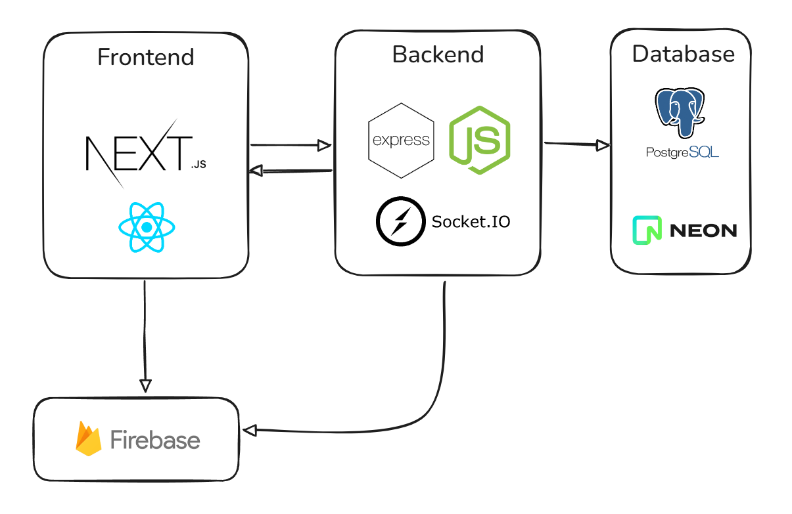

<h3 align="center">
    
     
</h3>

 🮠<strong>Roomio</strong> is an online multiplayer gaming platform with real-time integration.
 

   
  
  

# 🗂️ Table of Contents

- [About](#about)
- [Technologies](#technologies)
- [Architecture](#architecture)
- [In Action](#in-action)
- [How to Contribute](#how-to-contribute)

## 📚 About

**Roomio** is an online multiplayer gaming platform with authentication, ranking, and private rooms.
Currently, it includes the **Tic Tac Toe** game, featuring:

- Private room creation with shareable links.
- Invite players via direct link.
- Login system with Firebase (Google, Email/Password, etc.).
- User data storage and match history.
- Automatic scoring (+10 points per win).
- Real-time global ranking.
- Rematch feature for quick new games.

Main flow:

1. Login via Firebase.
2. Access the **Home** page with a list of available games.
3. Select a game → create or join a room (`/game/<game_slug>/<uuid>`).
4. If the user is not logged in, the room data is saved in **LocalStorage** until authentication.
5. Matches run in real time via **Socket.IO**.

---

## 🚀 Technologies

### **Frontend** [Hosting on: [Vercel ](https://vercel.com/)]

- [Next.js](https://nextjs.org/)
- [React](https://react.dev/)
- [Firebase](https://firebase.google.com/)
- [Tailwind](https://tailwindcss.com/)
- [SWR](https://swr.vercel.app/)
- [React Icons](https://react-icons.github.io/react-icons/)
- [React Confetti](https://www.npmjs.com/package/react-confetti)
- [Socket.IO Client](https://socket.io/)

### **Backend** [Hosting on: [Render ](https://render.com/)]

- [Node.js](https://nodejs.org/)
- [Express](https://expressjs.com/)
- [Socket.IO](https://socket.io/)
- [Firebase Admin](https://firebase.google.com/docs/admin)
- [PostgreSQL - NeonDB](https://neon.tech/)
- [pg (node-postgres)](https://node-postgres.com/)
- [Express Rate Limit](https://www.npmjs.com/package/express-rate-limit)

---

Note: This repository contains only the frontend code. The backend is stored in a separate, secure repository.

---

## 🏗️ Architecture

Roomio is split into three main layers: **Client (frontend)**, **Server (backend + real-time)** and **Database**. The server is the single source of truth for game rules and state — the frontend is responsible for UI and optimistic updates. Below is a summary of the responsibilities and the data flow.

<h3 align="center">
    
     
</h3>

### Components & responsibilities

- **Client (Next.js + React)**
  - Firebase authentication (client SDK).
  - UI for Home, Lobby (`/game/<game_slug>/<uuid>`), Game and Ranking pages.
  - Connects to the backend via Socket.IO for real-time gameplay.
  - Stores pending room info in LocalStorage if the user is not authenticated yet.
  - Uses SWR for fetching non-real-time endpoints (ranking, game list).
- **Server (Node.js + Express + Socket.IO on Render)**
  - Validates Firebase ID tokens (via Firebase Admin) on REST and Socket connections.
  - Holds the authoritative game rules and game state transitions (prevents cheating).
  - Emits and listens to real-time events (move, rematch, connect and others).
  - Persists completed games and score updates to PostgreSQL (NeonDB).
  - Exposes REST endpoints for ranking, game list, and room metadata.
  - Rate limiting and basic abuse protection (express-rate-limit).
- **Databases**
  - **Firebase** — user authentication and lightweight user profile data.
  - **PostgreSQL (NeonDB)** — tables for `games`, `scores` and other platform data that require relational storage and queries.
- **Deployment**
  - Frontend deployed to **Vercel**.
  - Backend deployed to **Render**.
  - Database hosted on **NeonDB**.

## In Action

You can try at: [Room.io](https://roomio-rust.vercel.app/)

## 😃 How to Contribute

- Leave a ⭐ if you liked the project!
- Fork the repository.
- Create a branch for your feature: `git checkout -b my-feature`
- Commit your changes: `git commit -m 'feat: my new feature'`
- Push to the branch: `git push origin my-feature`

---

## 📝 License

This project is under the MIT license.
See the [license page](https://opensource.org/licenses/MIT) for more details.

---

<h4 align="center">
    Made with 💜 by <a href="https://www.linkedin.com/in/matheus-almeida-602139182/" target="_blank">Matheus Almeida</a>
</h4>
